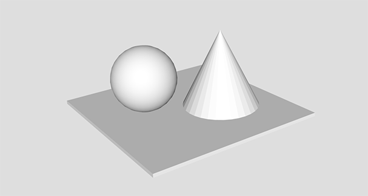
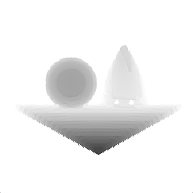

# sdfgen


Stand-alone GPU-based signed distance field generator from 3D triangle meshes. Used in Armory, written in Haxe and Kha.

## Run

Takes `mesh.obj` file and outputs raw 50x50x50 volume of floats into `out.bin`.

```
git clone https://github.com/armory3d/sdfgen
cd sdfgen/bin
```

Windows
```
./run_windows.bat
```

Linux
```
./run_linux.sh
```

MacOS
```
./run_macos.sh
```

## Viewer

A simple viewer is included. Copy resulting `out.bin` file into `sdfgen/viewer/bin`.

```
cd sdfgen/viewer/bin
./run_windows.bat
./run_macos.sh
./run_linux.sh
```

An included `mesh.obj` file:



Currently results into this:



## Build

[Node](https://nodejs.org) and [Git](https://git-scm.com) required.

1. Recursive clone

```
git clone --recursive https://github.com/armory3d/sdfgen
cd sdfgen
git submodule foreach --recursive git pull origin master
git pull origin master
```

2. a) Compile Krom
```
node Kha/make krom
```

2. b) Compile C++
```
node Kha/make --compile
```

## References

This tool builds upon the works kindly shared in:
- (!) https://kosmonautblog.wordpress.com/2017/05/01/signed-distance-field-rendering-journey-pt-1/
- http://advances.realtimerendering.com/s2015/DynamicOcclusionWithSignedDistanceFields.pdf
- http://www.iquilezles.org/www/articles/distfunctions/distfunctions.htm
- https://en.wikipedia.org/wiki/Möller–Trumbore_intersection_algorithm

## Tech

- [Iron](https://github.com/armory3d/iron)
- [Kha](https://github.com/Kode/Kha)
- [Krom](https://github.com/Kode/Krom)
- [Haxe](https://github.com/HaxeFoundation/haxe)
